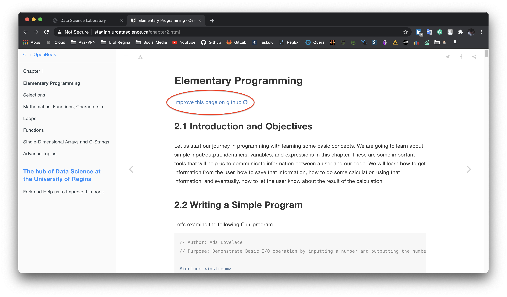
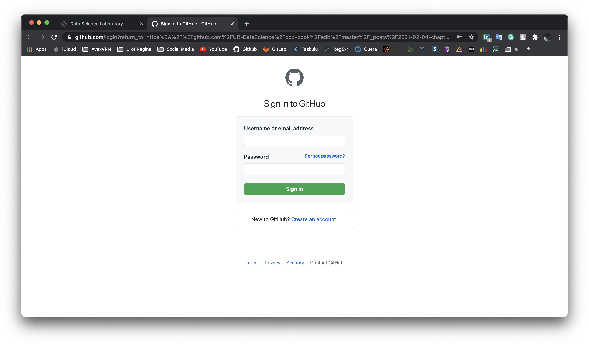
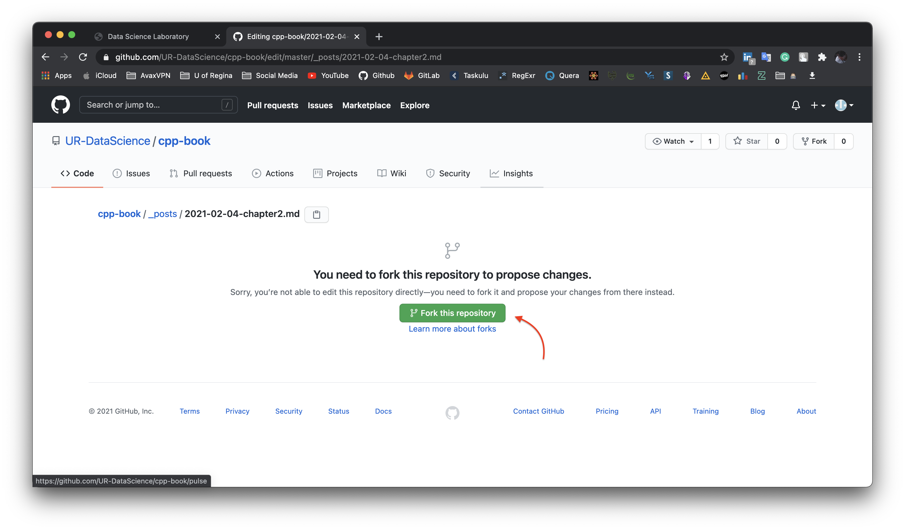
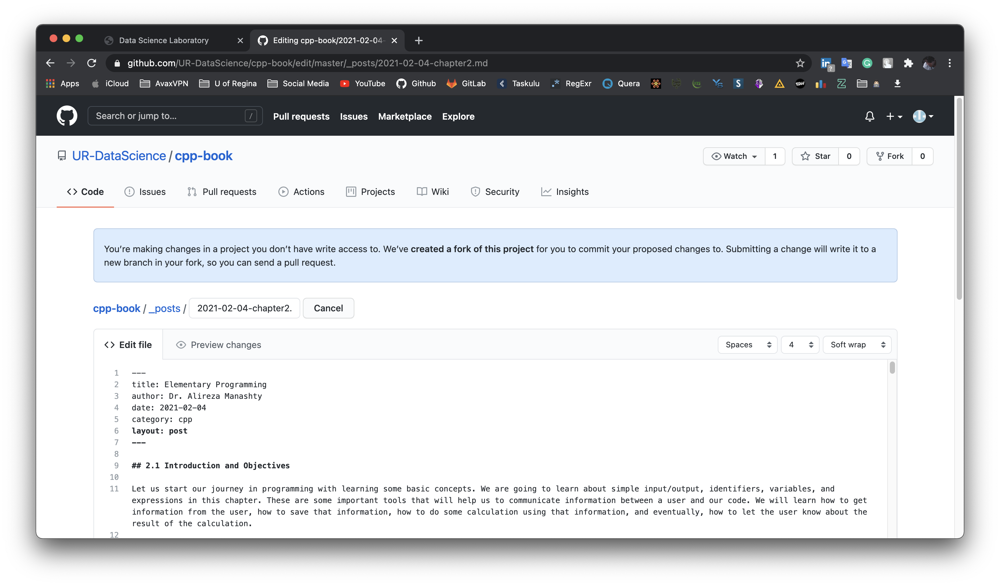
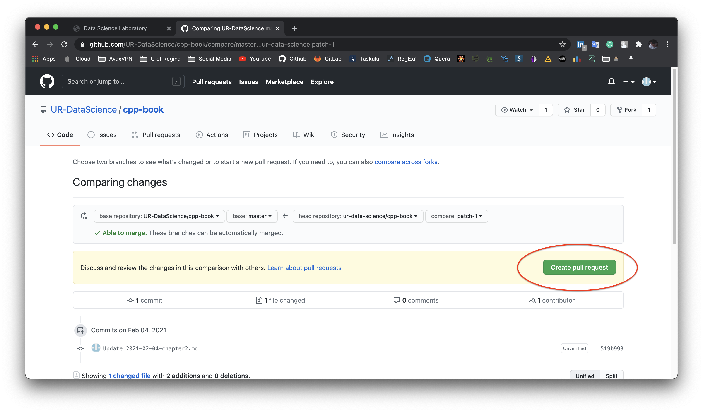

I am glad to announce that our university is going to have its own CS110 textbook 
which is open source and free for everybody. 
The textbook covers everything that you need to know for CS110 and also 
a little bit more.

In recent years, the contribution has been one of the most important factors 
in the growth of science in the world.

We need your help to improve this book and provide it to the world's people.

Here is some step that you can do to help us to enhance this book:

At the top of each page, you can see the "Improve this page on Github" link.
 

By clicking on the link you will redirect to the Github page of the Project. 
You may need to login in the Github for editing the content!

After login into your Github account, you will see a page 
that says you should fork the Repository. 

after clicking on the "fork this repository" button, 
a fork of the repository will create on your 
account(It's like a copy of the whole Project).
now it's time to commit your changes. You can change it unlimitedly.

Nothing is without mistake. 
There is always a better possibility that **you** can help us to achieve that.

After that, you need to send these changes for us through a "Pull Request". 
To make that you just need to click on "Create pull request" just like the picture below.

We will check your changes and Merge them to the website within a week.
