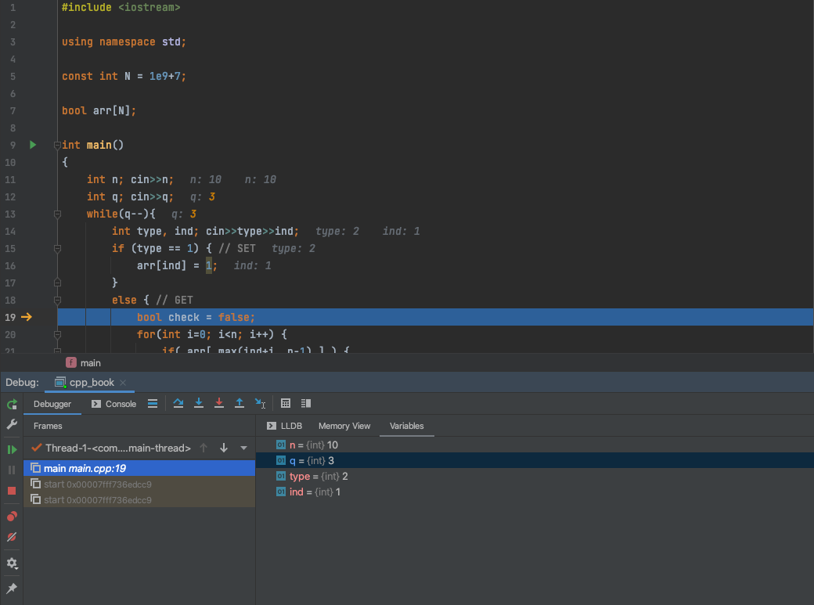

---

title: Elementary Programming
author: Dr. Alireza Manashty
date: 2021-02-04
category: cpp
layout: post

---
## 2.0 Outline
> Last chapter, you learnt about computers, their main components, how they interact with the outside world and how they communicate with other computers. You even understood the concept of problem solving. 
>
> In this chapter, you are about to begin an exciting journey of programming. You will learn about the following concepts:
>
>
>- [Programming languages](#21-programming-languages)
>- [Flowchart and Algorithms](#22-flowchart-and-algorithms)
>- [History of C++](#23-history-of-c)
>- [First C++ Program](#24-writing-your-first-c-program)
>- [StarBytes analogy](#25-starbytes-analogy)
>- [Programming Basics](#251-data--data-types)
>    * [Data types](#251-data--data-types)
>    * [Identifiers](#254-identifiers)
>    * [Constants](#253-constants)
>    * [Variables](#252-variables)
>    * [Input](#255-input)
>    * [Output](#256-output)
>    * [Expressions](#260-expressions)
>    * [Introduction to methods/functions](#261-functions)
>- [Compiling](#27-compiling)
>- [Programming style and common conventions](#28-programming-style-and-common-conventions)
>- [Programming errors](#29-programming-errors)


## 2.1 Programming Languages

Humans communicate to each other using **natural languages.** Examples of natural languages include English, French, Spanish, German, Hindi, Urdu, Arabic and many more. Computers perform specific tasks by running and executing programs. Humans make computers perform actions by writing programs, which consist of a set of instructions. 

 <p align="center">
  
  </p>

---
#### Food for thought:
<details>
    <summary style="cursor:pointer;">
        <i class="fa fa-angle-right" aria-hidden="true"></i>
        &ensp; 
         Have you ever wondered what languages computers understand?
    </summary>
     <br>
     Machine code.
     <br>
</details>

---
### 2.1.1 Machine code
Computers understand only **machine code.** Machine code consists of binary digits which means that machine code is written only using **‘0’s** and **‘1’s**. Computers directly understand machine code. However, you must have guessed already that machine code must be hard to learn, understand and write for human-beings (Don’t worry, we will not be making you write in machine code). 

### 2.1.2 Assembly language
Assembly language makes use of **mnemonics** to improve the readability and writability of the language.

- Mnemonics are meaningful English-like words which are used as the operation code in instructions. Examples of mnemonics include words like ADD, SUB, and DIV among others. ADD is the operation code of performing addition. 
- Since computers only understand machine code, an **assembler** is needed to translate assembly language into machine code. While assembly language is relatively easy to read and write compared to machine code, it can get complex in real application and require deep understanding and experience when coding for various processors.

Machine code is directly understood by computers while assembly language is very close to machine code. Machine code and assembly language are called low level languages. There is a 1-to-1 mapping between assembly language instructions and machine code implying that one assembly language instruction translates to one machine code instruction. Low level  languages are machine-dependent implying that they are not portable to other computers with different processor types.

### 2.1.3 High-level language language
>Does the complexity of machine code and assembly languages imply that a beginner student taking introductory Computer Science course will be unable to write code? 
>Of course not. 

While machine code and assembly language may require some expertise, **high-level languages** are relatively easy to understand, read, and write. 
- A high-level programming language is closer to “humans” since it can be easily understood by the programmer. 
- High-level programming languages not only have higher readability and writability, but mistakes can also be identified and corrected. 
- They are also portable implying that they are machine independent. Code written on one computer can be executed on another computer. Example of high-level languages include C, C++, Java, Python, Pascal among others. 

The reader will learn about the basics of programming using high level languages, and in fact, they will be writing their first C++ code (the famous “Hello World” code) later in this chapter. A compiler is needed to convert high level languages into machine code. You will more about compilers in the last chapter of this course.

### Summary of Programming Languages
 <p align="center">
  
  </p>

## 2.2 Flowchart and Algorithms

### 2.2.1 Algorithms
An **algorithm** is the process of listing the steps required to solve a particular problem and determining the order in which the steps need to be executed.

**Pseudocode** is an informal program description that does not contain code syntax or underlying technology considerations. Pseudocode summarizes a program’s steps (or flow) but excludes underlying details.[^pseudocode1] Pseudocode is a way of expressing an algorithm using syntax that is independent of any particular programming language. [^pseudocode2]

Let us consider an example of a problem:
<br>
**A user is asked to enter 10 numbers and the average is calculated.**
<br>

---
#### Food for thought:
<details>
    <summary style="cursor:pointer;">
        <i class="fa fa-angle-right" aria-hidden="true"></i>
        &ensp; 
        What are the steps to solve this problem?
        <p align="center">
        
        </p>
    </summary>
    <p><strong>Let us consider the steps to solve this problem first (Algorithm):</strong></p>
    <blockquote>
    <ul>
    <li>The user need to enter the three numbers</li>
    <li>The values need to be stored</li>
    <li>The values need to be added together (sum)</li>
    <li>The average need to be calculated</li>
    <li>The result need to be displayed to the user.</li>
    </ul>
    </blockquote>
    <p><strong>The resulting pseudocode is:</strong></p>
    <blockquote>
    <ol>
    <li>Prompt user to enter 3  numbers.</li>
    <li>Save the values in 3 different variables.</li>
    <li>Calculate the sum.</li>
    <li>Calculate the average.</li>
    <li>Display the average.</li>
    </ol>
    </blockquote>
    <p>Note that the pseudocode is written in a <strong>clear concise</strong> manner without following any strict programming language syntax.</p>

</details>
---

[^pseudocode1]: <https://www.techopedia.com/definition/3946/pseudocode>

[^pseudocode2]: <https://isaaccomputerscience.org/concepts/prog_pas_pseudocode?examBoard=all&stage=all>

### 2.2.2 Flowcharts
A **flowchart** is a visual representation of an algorithm. Symbols are used to graphically denote the different steps in an algorithm. 
 
<!--- Insert picture of symbol here and an example based on previous peudocode example--->
 
> Symbols - quick explanation

> Example based on the previous example

## 2.3 History of C++
This book uses C++ to teach programming basics. First, let us have a glance at the history of C++.

> More contents...

## 2.4 Writing your first C++ program
Let us begin with writing your very first C++ program. We will write the famous 'Hello World' program which is a simple program which display a message on the screen.

The code looks as follows:

```cpp
#include <iostream> 
using namespace std;

int main() 
{
  cout << "Hello World!" << endl;
  return 0;
}
```


You can see the code below on the replit application.

---
<details>
    <summary style="cursor:pointer;">
        <i class="fa fa-angle-right" aria-hidden="true"></i>
        &ensp; 
         Click here to understand the instructions on how to use the replit application
    </summary>
    <!--TODO: Add screenshot or instructions on how to use replit -->
    Instructions here...
</details>
---
<iframe
    height="400px"
    width="100%"
    src="https://replit.com/@DataScienceLab/224?embed=true"
    scrolling="no"
    frameborder="no"
    allowtransparency="true"
    allowfullscreen="true"
    sandbox="allow-forms allow-pointer-lock allow-popups allow-same-origin allow-scripts allow-modals">
</iframe>

---
#### Food for thought:
<details>
    <summary style="cursor:pointer;">
        <i class="fa fa-angle-right" aria-hidden="true"></i>
        &ensp; 
         What is the purpose of the 'Hello World' program?         
    </summary>
        Contents coming soon.
        <!-- Add contents about why Hello World is useful -->
</details>
    
<p align="center">

</p>
---

Let us learn about the basic syntax in our program.
  <p align="center">
  
  </p>


#### 2.4.1. The '#' sign 
To perform standard input and output operations, such as writing the output to the screen, we need to include a section of standard C++ code, known as **header iostream**.
The syntax is as follows:

```cpp
#include <iostream>
```
Lines beginning with a *hash* sign (`#`) are directive read and interpreted by what is known as the **preprocessor**.[^include] 
They are special lines interpreted before the compilation of the program itself begins.


#### 2.4.2. Built-in header file :iostream
The iostream header is required to perfrom standard input and output operations. Example: writing a message as output on a screen.
> Can include a link for more information here

#### 2.4.3. The main function
The execution of all C++ programs begins and end with the `main` function.
```cpp
int main()
{
    // Your program starts from here!
}
```
Regardless of where the function is located.
The open brace (`{`) indicates the beginning of main's function definition, and the closing brace (`}`) indicates its end.
We will learn more about functions in [Chapter 9 (Functions)](/chapter9)

To learn more about the **main** function, check [this](https://www.cplusplus.com/doc/tutorial/program_structure/#:~:text=The%20function%20named%20main%20is%20a%20special%20function%20in%20all%20C++%20programs;%20it%20is%20the%20function%20called%20when%20the%20program%20is%20run.%20The%20execution%20of%20all%20C++%20programs%20begins%20with%20the%20main%20function,%20regardless%20of%20where%20the%20function%20is%20actually%20located%20within%20the%20code) out.

[^include]: <https://www.cplusplus.com/doc/tutorial/program_structure/#:~:text=The%20function%20named%20main%20is%20a%20special%20function%20in%20all%20C++%20programs;%20it%20is%20the%20function%20called%20when%20the%20program%20is%20run.%20The%20execution%20of%20all%20C++%20programs%20begins%20with%20the%20main%20function,%20regardless%20of%20where%20the%20function%20is%20actually%20located%20within%20the%20code>

## 2.5 StarBytes Analogy
We are going to use the analogy of a coffee shop known as StarBytes to help the reader better grasp basic programming concepts. 

<p align="center">

</p>

#### 2.5.1. Data & Data Types
StarBytes sell mainly drinks. Infact, it sells different kinds of drinks including:
- Coffee
- Hot Chololate
- French Vanilla
- Tea
- Latte
- Ice Coffee among others.

In our case, the data are the drinks. Just like we have different types of drinks, there are various data types. 

<p align="center">

</p>

In Computer Science, **data** is information which is processed or stored. 
Depending on the data type, the compiler allocates memory for the variable accordingly. In C++, there are 2 kinds of data types namely:
1. Primitive data types
    - These consist of data types which are built-in the C++ language.
2. Non-primitive data types. 
    - These types are **not** defined by the programming language. Non-primitive data types are defined by the user.

<p align="center">

</p>

You will learn more about data types in the next chapters. 
To help you with the programs you will be writing, the table below summarizes the different types of numeric data types. 

>Summary of numeric data types


#### 2.5.2. Variables
Now that we know about **data** and **data types,** it is time to understand how to use them. 
Coming back tp our StarBytes Analogy, in order to be able to serve the drinks to customers, cups are used.  The cups themselves are of no use but they are need as a vessel in which the drinks are poured into to be served.

<p align="center">

</p>

In computer, **variables** by themselves, are just vessels used for storing data values. In fact, the creation of a variable leads to some space being reserved in memory. How much memory is reserved and what can be stored in the reserved memory space would depend on the data type of the variable.

**Problem:** There are many customers  who order the same drink (or different drinks) at the same time. How will the coffee shop differentiate between the items of different customers?
<p align="center">

</p>

<p align="center">

</p>


A variable can be created and linked to a specific data type through a **declaration statement.**

###### Declaring a variable
Declaring a cup is like writing a customer's name on a cup.

**Syntax**
```cpp
type identifier;
```
**Example**
```cpp
int i;
double average;
char c;
```
<p align="center">

</p>

###### Declaring and initializing a variable
A variable can be declared and given a value in a single statement. 

**Syntax**
```cpp
type identifier = intial value;
```
**Example**
```cpp
int i = 5;
double average = 32.5;
char c = ‘a’;
```

<p align="center">

</p>

###### Assigning values to a variable
Values can be assigned to variables after they have been initially declared. An example would be that the value of a variable is updated. 

**Syntax**
```cpp
identifier = value;
```
**Example**
```cpp
i = 10;
average = 15;
c = ‘a’;
```

<p align="center">

</p>

###### Moving data between variables
Data within a variable can be moved to another variable as well. Let us look at an example to better understand this.

- You can always pour the content of a small cup to a larger cup.
<p align="center">

</p>

- But the content of a larger cup can only be moved into a small cup, if the content fills the smaller cup. The small cup will **overflow** if it is not big enough to contain the contents of the larger cup. 

<p align="center">

</p>

When we move data from a variable of a specific data type to another variable of another type, we are performing a type conversion. There are 2 types of conversion namely:
 - Type coercion is the implicit (automatic) conversion of a value from one data type to another.

**Example**
```cpp
int i;
float j
j = i;
```

 - Type casting is the explicit conversion of a value from one data type to another; also called type conversion.
 
**Example**
```cpp
int i;
float j;
i = int(10.4); // i = 10 since i is integer. The fraction part is truncated.
```

#### 2.5.3. Constants
A constant is also a vessel used to hold data. However, the value stored cannot be changed during the execution of the program.

<!-- Add a StarBytes analogy -->
>analogy

**Syntax**
```cpp
const type IDENTIFIER = value;
```
**Example**
```cpp
const double TAXRATE = 0.11;
```
> Note: Usually, the naming convention for a constant is that it should be **ALL CAPS**.
> Once a value has been assigned to a constant, it does not change during the execution of the program.

###### Advantages of using constants
- Meaningful constant names increase the code readability. 
- Easier to debug the program. 
- Saves time in case we need to change the value of the constant. Let us say the TAX_RATE increases to 15%. We just need to change the constant initialization statement. 

#### 2.5.4. Identifiers
An identifier is a name that is assigned by the user for a program element such as variable, type, template, class, function or namespace.[^id]

---
#### Food for thought:
<details>
    <summary style="cursor:pointer;">
        <i class="fa fa-angle-right" aria-hidden="true"></i>
        &ensp; 
         What is the difference between a variable and an identifier?
        <p align="center">
        
        </p>
    </summary>
    Example:
    <code>int number; </code>
    To store a number say the age of a student, a variable is needed. Since we want to store age, <code>int</code> is an appropriate data type. The variable is given the name number and in the rest of the code, we call the variable by its name.
</details>
---

###### Naming convention for identifiers
- Keywords cannot be used as identifiers.
    - A **keyword** is a name in the programming language which has a predefined special meaning to the compiler. 
- Can start with a letter or _
    - Example of legal identifiers: computer, _computer
- Can have letters or _ or numbers
    - Example of legal identifiers: _computer123, _123
    - Example of non-legal identifiers: 123, computer science, 1_computer
- Use meaningful names for identifiers.
- Use camelCase format:
    - Lower camel case for local variables, and

    <p align="center">
    
    </p>

    - Upper Camel Case for functions/methods.

   <p align="center">
    
    </p>

[^id]: <https://www.thoughtco.com/definition-of-identifier-958092>


#### 2.5.5. Input
To obtain a value from the user through the console, we use the **input statements**. 

**Syntax**
 - ```std::cin >> number;```
 - ```cin >> number; ``` in case you include the ```using namespace std;``` declaration.

###### Input statement
<p align="center">

</p>

###### Multiple input in a single statement
**Syntax**
 - ```std::cin >> number1 >> number2 >> number3;;```
 - ```cin >> number1 >> number2 >> number3;```

<p align="center">

</p>

#### 2.5.6. Output
To display messages on the screen, we use **output statements.**

**Syntax**
 - ```std::cout << "Your Message";```
 - ```cout >> "Your Message"; ``` in case you include the ```using namespace std;``` declaration.

Note that after a cout statement does not insert a new line at the end of the output.
In order to insert a new line, one can include ```cpp <<endl; ```

> more about endl
> probably add a replit iframe here to show cout and endl

#### 2.5.7. Comments
Sometimes, there is the need to put some comments in the code. This makes the code more readable for other people or even for future reference. 

Comments can be added to:
- just one line or part of a line

``` cpp
#include iostream;
using namespace std;

int main ()
{
    cout <<"Please enter 3 numbers" <<endl; //This is a comment
    //This is also a comment
}
```
- over several lines (Comment block).

``` cpp
#include iostream;
using namespace std;

int main ()
{
    cout <<"Please enter 3 numbers" <<endl; 

    /*
    This is a block of comment 
    Multiple lines of 
    comments    
    */
}
```
#### 2.5.8. The return statement
The main function is both entry point and exit point of a program. When a program ends, it will return a number. 
- The number returning by the main function has a meaning for the operating system (OS). The OS monitors the code, and when the program ends by returning 0, it means that the program has run successfully.
- By default, a C++ program returns 0 when the program is run successfully, and returns -1 or whatever when an error occurs during the runtime.
- So, it is highly recommended using return 0; at the end of your program.

#### 2.5.9.Semicolon
This character marks the end of the statement, just as the period ends a sentence. All C++ statements must end with a semicolon character ```;```.

#### 2.6.0 Expressions
Let us consider the StarBytes Analogy to understand **Expressions**.

>Suppose a customer want to have a coffee with 2 spoons of sugar, 1 cream and topped with 1 swirl of whipped cream.

<p align="center">

</p>

- Sugar, cream and whippedCream are variables used in the making of a drink.
- The expression is made up from those variables which are bound together with the addition operator. 

Arithmetic Expressions are defined as **variables** and **constants of integral** and **floating-point types** which can be combined using arithmetic operators.

#### 2.6.1. Functions
<!--TODO: Add StarBytes Analogy from Powerpoint here-->

>StarBytes analogy

Functions allow to structure programs in segments of code to perform individual tasks.
In C++, a function is a group of statements that is given a name, and which can be called from some point of the program.


**Syntax**
```cpp
returnType FunctionName (datatype parameter1, datatype parameter2) {
    // function body
    // block of code which perform a specific task.
}
```

**Example**
``` cpp
#include iostream;
using namespace std;

int main ()
{
    cout << MyFunction(2); // This statement calls MyFunction and prints 4 
}

int MyFunction (int x)
{
    return x*2;
}
```

## 2.7 Compiling
We have learned about machine code (language understood directly by the computer) at high level programming languages (language used by human to code). Next we will have a overview of the compiling. Compiling is the process of converting code written in high level languages into machine code.

<p align="center">

</p>

- A source code is a code written in a high level language.
-  A compiler is the program used to perform the conversion. The compiler performs lexical analysis and syntactical analysis. You will learn more how lexical and syntax analyzers work in your Programming Language Concepts course.
- An object code is the code generated after the compilation. It is the binary equivalent of the source code. [^compiling] This is the executable version of the code, before linked libraries are included. [^compiling]
-  A linker is a specialized program  which combines the object file with other previously compiled object files (in particular run-time modules) to create an executable file. [^linker]


[^compiling]: <https://isaaccomputerscience.org/concepts/sys_trans_stages?examBoard=all&stage=all>
[^linker]: <http://www2.hawaii.edu/~takebaya/ics111/process_of_programming/process_of_programming.html>

<!-- TODO: Add interpreter, Java Bytecode notes and difference between the compiler and the interpreter -->

>TODO: Add interpreter, Java Bytecode notes and difference between the compiler and the interpreter


## 2.8 Programming style and common conventions
<!-- Add the following tips -->
> Coming soon: Programming tips 

> Common convention

## 2.9 Programming errors
Well, since we are humans, we tend to make mistakes even in writing programs. The main programming errors are:

#### 2.9.1. Syntax errors
 Syntax errors occur when the rules and grammar of a specific programming language is violated. it is also commonly known as compile time errors because syntax errors are detected by the compiler. 

Example:

   - Missing matching parenthesis
   - Forgetting to add some column at the end of a statement
   - Misspelling a keyword

   > Coming soon. An example

#### 2.9.2. Runtime errors
 
As its name suggests runtime errors occur during runtime. A runtime error occurs after successful compilation while the program is executing/running.[^runtime] Runtime errors are harder to diagnose since they are not automatically detected by the compiler.

Example:
   - Division by zero
   - Referencing missing files
   - Incorrect array indexing

   > Coming soon. An example

 [^runtime]: <https://www.geeksforgeeks.org/errors-in-cc/>
 
#### 2.9.3. Linker errors
Linker error occurs when the linker tries to link the main's object files with other objects and librairies. When the executable code cannot be generated successfully, an error os produced. [^runtime]

<!-- check example from this site: https://www.geeksforgeeks.org/errors-in-cc/ -->

Example:
- Linker errors could occur due to wrong function prototyping or incorrect header files.
- Writing Main() instead of main() also cause linker errors. 

#### 2.9.4. Logic errors
A logic error occurs when given a set of input the expected output is not obtained. in the case of a logic error, the program compiles an execute successfully but the desired output is not obtained Due to a fault in the logic of the code.

Example:
- An output statement which is supposed to display the average displays the sum instead.

> Coming soon. An example

## 2.9.5. Debugging- Finding and Fixing Errors

- Syntax errors are easy to find and correct.
- Runtime errors are not difficult to find either. They can be due to the wrong algorithm, misspelled keywords or syntax
usage.

In both cases, we can follow the address of the error which is shown in the console when a compilation error occurs and try to fix them.


>Example: 
>The console message in the snapshot above shows that the error is located in line 7 and the 5th character.

- On the other hand, some sorts of errors are not that obvious (Logic errors).
- The program may compile successfully but the output is not the expected one.
- Logic errors are also called *bugs*.
- We can perform debugging to fix logic errors.
- **Debugging** is the process of finding and correcting errors. 

> One of the most common approach to debugging is to easily follow the flow of the program and hand trace it, so you can step through instruction, track the values of variables, and finally find and correct the errors. 
> However, regarding the complex program with a variety of the variables and statements, it cannot be that easy and fast to be done manually.

Followings are some technics and tools work as debuggers:

###### Print Out Step by Step!
- In each line of a code, you should know the value of each variable; if you are not sure about them, print them out.
  > For more readability, you can print the value of a variable *before* and *after* a statement. 
  > So, you can see how the statement changes its value.

- Detecting whether a particular scope of a code is being executed or not, you can easily print out a message in that
considered part of the code.
  ```cpp
  #include <iostream>
    using namespace std;
  
  int main()
  {
      int a;
      cin>>a;
      if ( (a*24/14)%2 > 3 ) 
      {
          // This message never appear as long as the condition of the if statement will never occur. 
          cout << "got here!" << endl; 
          a *= 2;
      }
      cout << a << endl;
      return 0;
  }
  ```
###### Setting Breakpoint
When you know where your programming error starts, a breakpoint on that line can be set out and have the program executed.
We can set as many as breakpoints we want, at a specific statement, such as `break` and `continue` to skip the rest of 
the program.


###### Run the Program After Each Change
This is not a technique for debugging, but a method to make sure you don't miss any bugs in your code.
To show the effect of changes in each statement in your program,you can run one statement in the program at a time.

###### Use IDE's Debugger
Usually IDEs have some sorts of tools for debugging which allows to check the values of the variables and show  
the execution of the program, line by line. These utilities also let you:
- set breakpoints through the program, 
- modify variables, and
- run different sections of a code separately,etc.



## References

