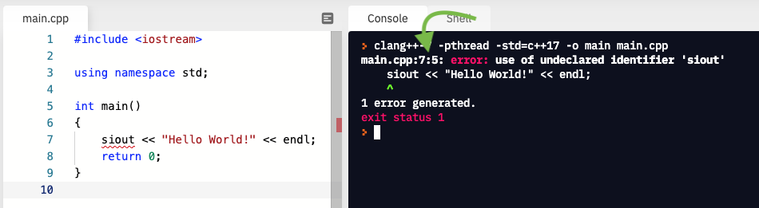
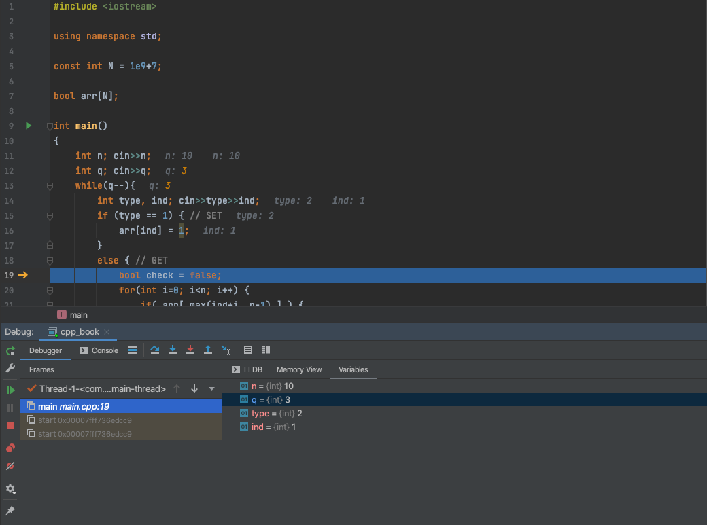

---

title: Selections
author: Dr. Alireza Manashty
date: 2021-02-04
category: cpp
layout: post

--- 

## 3.1 Introduction and Objectives 

In the previous chapters, we learned about programming fundamentals. 
In this chapter, we will learn how to use conditional instructions to do some particular tasks when 
the input satisfies some provided conditions. Selection statements use conditions that are
*Boolean expression* conditions. Now we are going to introduce Boolean types and relational. 
operators.


## 3.2 The Bool Data Type 

In C++, data type *bool* is used to represent *Boolean data*. A Boolean expression asserts 
(states) that something is `true` or `false`. It is named after the mathematician George Boole.
Each *bool* constant or variable contains one of these two possible values: `true` or `false`. 
`true` and `false` are two C++ constants. `true` has the value `1` and `false` has the value `0`.
If a testing expression is not of *bool* type, it is coerced to *bool* type automatically when 
it is evaluated. A *non-zero* value is coerced to `true`, and a *zero* value is coerced to `false`.


## 3.3 `if-then` and `if-then-else` Statements

`if` statement allows the programmer to change the logical order of a
program; that is, make the order in which the statements are executed
differ from the order in which they are listed in the program.


### 3.3.1 `if-then` Statement

The `if-then` statement uses a Boolean expression to determine whether to
execute a statement or to skip it. The syntax template is as follows:

```cpp
if(boolean_Expression)
{
    Statement;
}
```

The expression in parentheses can be of any simple data type. 
Almost without exception, this will be a logical (Boolean) expression; if not, 
its value is implicitly coerced to type `bool`

> Non-zero value means `true`, zero value means `false`.

```cpp
int number, sum;
sum = 10;
cout << "Please enter an integer value: " << endl;
cin >> number;
if( number < 0 )
{
    number = 0;
}
sum = sum + number;
cout << "The sum is " << sum << endl;
```

The expression (`number < 0`) is evaluated. If the result is `true`, the statement `number = 0;` is executed. 
If the result is `false`, the statement is skipped.
In either case, the next statement to be executed is `sum = sum + number`.


### 3.3.2 `if-then-else` Statement

`if-then-else` statement uses a Boolean expression to determine which one of the two statements 
to execute. 
Here is the syntax template:

```cpp
if(Expression)
{
    Statement A
}
else
{
    Statement B
}
```

The expression in parentheses will be evaluated with the result of `true` or `false`. 
Here is an example:

```cpp
cout << "You are ";
if(age >= 65)
{
    cout << "a senior ";
}
else
{
    cout << "not a senior ";
}
cout << "citizen." << endl;
```

- The characters `"You are"` are sent to the output stream. 
- The expression `age >=65` is evaluated. 
- If the result is `true`, the characters `"a senior "` are sent to the output stream. 
- If the result is `false`, the characters `"not a senior "` is sent to the output stream.
- In either case, the next statement to be executed sends the characters `"citizen"` to the output stream.


##### There is one thing to point out here:

Any statement in an `if` or `else` statement could be a block or a compound statement. 
If so, they must be enclosed in a pair of curly braces (`{ }`). 
Here is an example that also shows a compound expression:

```cpp
if(age > 65 && gender == 'f')
{
    cout << "Quilting group meets:"; 
    cout << "Thursday afternoons at 4:00 p.m.";
}
```

> #### Should Curly Braces Appear on Their Own Line?
>
> If you have only one line of statement, you are able to take the braces off. However,this method is not recommended at all.
> [To find more click here](https://softwareengineering.stackexchange.com/questions/2715/should-curly-braces-appear-on-their-own-line).


## 3.4 Two-Way `if-else` Statements

If you want to perform an action, and a specific condition happens, you could use a
*one-way if statement*. For example, if you want to increment a counter when number `x` is an 
*even* number and do nothing when `x` is an *odd* number you could *use one-way if statement*:

```cpp
if( x % 2 == 0 )
{
    counter++;
}
```

However, if you want to increment the counter when the number is even and 
decrement it when it is odd, you need to use two-way if-else statement:

```cpp
if( x % 2 == 0 )
{
    counter++;
}
else
{
    counter--;
}
```


## 3.5 Nested `if` and Multi-Way `if-else` Statements

An `if-Then` statement uses Boolean expression to determine whether to execute or skip a 
statement, and determine which one of the two statements to execute. The statements to be 
executed or skipped could be simple statements or compound statements (blocks). They also 
can be an If Statement. An `if` statement within another `if` statement form a nested `if` statement.

> You will soon be learning about the C++ `switch` statement.
> For very complex `if`/`else` constructs, it is *preferable* to use the `switch` instead.

The following example is a nested `if` statement:

```cpp
cout << "You are ";
if(age >= 65)
    cout << "a senior." << endl;
else
    if(age >= 19)
        cout << "an adult." << endl;
    else
        if (age >= 13)
            cout << "a teenager." << endl;
        else
            cout << "a child." << endl;
cout << "You are a great person." << endl;
```

- The characters `"You are "` are sent to the output stream. The expression `age >= 65` is evaluated.

- If the result is `true`, the characters `"a senior"` are sent to the output stream. 

- If the result is `false`, the expression `age >= 19` is evaluated. 

- If the result is `true`, the characters `"an adult."` are sent to the output stream. 

- If the result is `false`, the expression `age >= 13` is evaluated. 

- If the result is `true`, the characters `"a teenager."` are sent to the output stream. 

- If the result is `false`, the expression `"a child."` is sent to the output stream. 

- In any case above, the next statement to be executed sends the characters `"You are a great person."` to the output stream.

> #### NOTE:
> 
> Once age has a value, only one statement is selected to be executed. 
> If we add braces to the program segment, it would be easy to read.

Let's look at it now:

```cpp
cout << "You are ";
if (age >= 65)
{
    cout << "a senior." << endl;
    cout << "*****" << endl;
}
else
{
    if(age >= 19)
    {
        cout << "an adult." << endl;
        cout << "*****" << endl;
    }
    else
    {
        if (age >= 13)
        {
            cout << "a teenager." << endl;
            cout << "*****" << endl;
        }
        else
        {
            cout << "a child." << endl;
            cout << "*****" << endl;
        }
    }
}
cout << "You are a great person." << endl;
```

Another example:

```cpp
#include <iostream>
using namespace std;
int main()
{
    char grade;
    cout << "Please enter a letter grade (A, B, C, D, or F): " << endl;
    cin >> grade;
    if(grade == 'A')
        cout << "Great work. " << endl;
    else if(grade == 'B')
        cout << "Good work. " << endl;
    else if(grade == 'C')
        cout << "Passing work. " << endl;
    else if(grade == 'D' || grade == 'F')
    {
        cout << "Unsatisfactory work. " << endl;
        cout << "See your instructor." << endl;
    }
    else
        cout << grade << " is not a legal grade." << endl;
    
    cout << endl;
    return 0;
}
```

###### Try it yourself:

<iframe 
  height="400px" 
  width="100%"  
  src="https://repl.it/@Baranerf/Ch31?lite=true" 
  scrolling="no" 
  frameborder="no" 
  allowtransparency="true" 
  allowfullscreen="true" 
  sandbox="allow-forms allow-pointer-lock allow-popups allow-same-origin allow-scripts allow-modals">
</iframe>


## 3.6 Common Errors and Pitfalls

The most common errors beginners make in writing conditional statements are syntax
errors. 

- Errors such as spellings and case sensitivity
  - It should be `if` and `else` instead `IF`, `If`, `Else`, or `ELSE`.
  - It should be `else if` instead `elseif`.
  
- Forgetting necessary braces
  
  ```cpp
  if (x > 2)
  {
      int z = x + y;
      cout << "z is" << z << endl;
  }
  ```  

- Mistaking `==` for `=`
  
  ```cpp
  if (y==2)
  {
      int z= x + y;
      cout << "z is " << x << endl;
  }
  ```


- Error of the improper usage of semicolons after the *if statement*,

  ```cpp
  // there should not be semicolon after an if statement
  if(x>5);
      cout << "x is greater than 5";
  else
      cout << "x is less than 5";
  ```


## 3.7 Generating Random Numbers

### Rand Function `rand()`

```cpp 
int rand(void);
```

#### Generate Random Number

Generate random number returns a *pseudo-random* integral number in the range
between `0` and `RAND_MAX`[^RAND_MAX].

[^RAND_MAX]: [RAND_MAX](http://www.cplusplus.com/RAND_MAX) is a constant defined in [`<cstdlib>`](http://www.cplusplus.com/cstdlib).

This number is generated by an algorithm that returns a sequence of
apparently non-related numbers each time it is called. This algorithm
uses a *seed* to generate the series, which should be initialized to some
distinctive value using function [srand](http://www.cplusplus.com/srand).

A typical way to generate trivial pseudo-random numbers in a determined
range using `rand` is to use the modulo of the returned value by the range
span and add the initial value of the range:

```cpp
v1 = rand() % 100; // v1 in the range 0 to 99        
v2 = rand() % 100 + 1; // v2 in the range 1 to 100    
v3 = rand() % 30 + 1985; // v3 in the range 1985-2014
```

Notice though that this modulo operation does not generate uniformly
distributed random numbers in the span (since in most cases this
operation makes lower numbers slightly more likely).

C++ supports a wide range of powerful tools to generate random and
pseudo-random numbers
(see [<random>](http://www.cplusplus.com/random) for more info).

An integer value between 0
and [RAND_MAX](http://www.cplusplus.com/RAND_MAX).

Example:

```cpp
//  rand example: guess the number

#include <stdlib.h>

// srand, rand

#include <iostream>

using namespace std;

int main()
{
    int iSecret, iGuess;

    //  initialize random seed:                           
    // generate secret number between 1 and 10:

    iSecret = rand() % 10 + 1;                                 
    
    do
    {
        cout << "Guess the number(1 to 10): ";
        cin >> "%d", &iGuess;
        
        if(iSecret<iGuess)
            cout << "The secret number is lower" << endl;
        else if(iSecret>iGuess)
            cout << "The secret number is higher" << endl;
    } while(iSecret!=iGuess);

    cout << "Congratulations!";
    return 0;
}
```

In this example, the random seed is initialized to a value representing
the current time (calling [time](http://www.cplusplus.com/time)) to
generate a different value every time the program is run.

Possible output:

```text
Guess the number (1 to 10): 5 
The secret number is higher   
Guess the number (1 to 10): 8 
The secret number is lower    
Guess the number (1 to 10): 7 
Congratulations!             
```

## 3.8 Logical Operators

The operator `!` is the C++ operator for the
Boolean operation `NOT`. It has only one operand, to its right, and
inverts it, producing `false` if its operand is `true`, and `true` if its
operand is `false`. Basically, it returns the opposite Boolean value of
evaluating its operand. For example:

| Syntax         |  Description
|   :-----:      | :----------------
| `!(5 == 5)`    | evaluates to false because the expression at its right `(5 == 5)` is true
| `!(6 <= 4)`    | evaluates to true because `(6 <= 4)` would be false
| `!true`        | evaluates to false
| `!false`       | evaluates to true 
                                 

The logical operators `&&` are used when evaluating two
expressions to obtain a single relational result. 
The operator `&&` corresponds to the Boolean logical operation `and`, 
which yields `true` if both operands are `true`, and `false` otherwise.
The following panel shows the result of operator `&&` evaluating the expression `a && b`:

###### `&&` OPERATOR (`and`)

| `a` | `b` | `a && b` |
|:---:|:---:|:--------:|
|true |true | **true** |
|true |false| **false**|
|false|true | **false**|
|false|false| **false**|

The operator `||` corresponds to the Boolean logical operation `or`, which
yields `true` if both operands are `true`, thus being `false` only
when both operands are `false`. Here are the possible results of `a||b`:

###### `||` OPERATOR (`or`)

|  `a`  |   `b`  |   `a || b`   |
|:-----:|:------:|:------------:|
| true  | true   |   **true**   |
| true  | false  |   **true**   |
| false | true   |   **true**   |
| false | false  |   **false**  |


For example:

```cpp
( (5 == 5) && (3 > 6) ) // evaluates to false ( true && false )       
                                                                       
( (5 == 5) || (3 > 6) ) // evaluates to true ( true || false )    
```

When using the logical operators, C++ only evaluates what is necessary
from left to right to come up with the combined relational result,
ignoring the rest. Therefore, in the last example `((5==5)||(3>6))`,
C++ evaluates first whether `5==5` is `true`, and if so, it never checks
whether `3>6` is `true` or not. This is known as 
*short-circuit evaluation*, and works like this for these operators:

###### Operator Short-circuit:

| `&&` | if the left-hand side expression is `false`, the combined result is `false`. (the right-hand side expression is never evaluated)|
|:----:|:--------------------------------------------------------------------------------------------------------------------------------|
| `or` | if the left-hand side expression is `true`, the combined result is `true`. (the right-hand side expression is never evaluated)  |


This is mostly important when the right-hand expression has side effects, 
such as altering values:

```cpp
if( (i<10) && (++i<n) ) { /*...*/ } // note that the condition increments i   
```

Here, the combined conditional expression would increase `i` by one, but
only if the condition on the left of `&&` is `true`, because otherwise,
the condition on the right-hand side (`++i<n`) is never evaluated.


## 3.9 Switch Statements

`switch` statement is a *selection statement* that can be used instead
of a series of *if-then-else* statements.It is much
better for complex expressions. Alternative statements are listed with
a `switch` label in front of each. A `switch` label is either a case label
or the word `default`. 

A case label is a word case followed by a
`*constant integral expression*`. `*An integral expression*` is called a `switch`
expression used to match one of the values on the case labels. The
statement associated with the matched value is the statement
that is executed. Execution then continues sequentially from the matched
label until the end of the `switch` statement or `break` statement is encountered. Basically,
it transfers control to one of the several statements, depending on the value of a condition.

**Syntax:**
```cpp
switch(expression)
{
  case a:
    // code block
    break;
  case b:
    // code block
    break;
  default:
    // code block
}
```

The body of a `switch` statement may have an arbitrary number
of case: labels, as long as the values of all `constant_expressions` are
unique (after conversions/promotions). At most one `default:` label may be
present (although `nested switch statements` may use their
own `default:` labels or have `case:` labels whose constants are identical
to the ones used in the enclosing `switch`)

If `condition` evaluates to the value that is equal to the value of one
of `constant_expressions`, then control is transferred to the statement
that is labeled with that `constant_expression`.

If `condition` evaluates to the value that doesn't match any of
the case: labels, and the default: label is present, control is
transferred to the statement labeled with the default: label.

The [break](https://en.cppreference.com/w/cpp/language/break) statement,
when encountered in `statement` exits the `switch` statement:


Compilers may issue warnings on fallthrough (reaching the next case label without a break) 
unless the attribute appears immediately before the case label to indicate that the fallthrough 
is intentional.

Example of several usage cases of `switch` statement:

```cpp
#include <iostream>

int main()
{
    int i = 2;
    switch(i) 
    {
        case 1: 
            std::cout << "1";
        case 2: 
            std::cout << "2"; //execution starts at this case label
        case 3: 
            std::cout << "3";
        case 4:
        case 5: 
            std::cout << "45";
            break; //execution of subsequent statements is terminate
        case 6: 
            std::cout << "6";
    }

    std::cout << '\n';

    switch(i)
    {
        case 4: 
            std::cout << "a";
        default: 
            std::cout << "d"; //there are no applicable constant_expressions
        //therefore default is executed
    }

    std::cout << '\n';
    
    switch(i)
    {
        case 4:  
            std::cout << "a"; //nothing is executed
    }

    // when enumerations are used in a switch statement, many compilers
    // issue warnings if one of the enumerators is not handled
    enum color {RED, GREEN, BLUE};

    switch(RED)
    {
        case RED: 
            std::cout << "red\n";
            break;
        case GREEN: 
            std::cout << "green\n";
            break;
        case BLUE: 
            std::cout << "blue\n"; 
            break;
    }

}
```

Output:
```text
2345
d
red
```

Try it yourself:

<iframe 
  height="400px" 
  width="100%" 
  src="https://repl.it/@Baranerf/Ch32?lite=true" 
  scrolling="no" 
  frameborder="no" 
  allowtransparency="true" 
  allowfullscreen="true" 
  sandbox="allow-forms allow-pointer-lock allow-popups allow-same-origin allow-scripts allow-modals">
</iframe>


## 3.10 Conditional Ternary Operators

*The conditional operator* evaluates an expression, returning one value if
that expression evaluates to `true`, and a different one if the expression
evaluates as `false`. Its syntax is:

```cpp
condition ? result1 : result2
```

If condition is `true`, the entire expression evaluates to `result1`, and otherwise to `result2`.

```cpp
7==5 ? 4 : 3     // evaluates to 3, since 7 is not equal to 5.
7==5+2 ? 4 : 3   // evaluates to 4, since 7 is equal to 5+2.
5>3 ? a : b      // evaluates to the value of a, since 5 is greater than 3.
a>b ? a : b      // evaluates to whichever is greater, a or b.  
```

###### Example

```cpp
#include <iostream>

using namespace std;
int main()
{
    int a, b, c;
    a=2;
    b=7;
    c = (a>b) ? a : b;
    cout << "c is " << c << endl;
}
```

###### Output:

```text
c is 7
```

###### Try it yourself:

<iframe 
  height="400px" 
  width="100%" 
  src="https://repl.it/@Baranerf/Ch33?lite=true" 
  scrolling="no" 
  frameborder="no" 
  allowtransparency="true" 
  allowfullscreen="true" 
  sandbox="allow-forms allow-pointer-lock allow-popups allow-same-origin allow-scripts allow-modals">
</iframe>


In this example, `a` is 2, and `b` is 7, so the expression which is evaluated
(`a>b`) is not `true`, thus the first value specified after the question
mark was discarded in favor of the second value (the one after the
colon) which was `b` (with a value of `7`).


## 3.11 Operator Precedence and Associativity

If *relational operators* and *Boolean operators*
are combined in the same expression in C++, the Boolean operator `NOT (!)`
has the highest precedence, the relational operators have the next
highest precedence, and the Boolean operators `AND (&&)` and `OR (||)`
have the lowest. Expressions in parentheses are always evaluated first.

A single expression may have multiple operators. For example:

```cpp
x = 5 + 7 % 2;
```

In C++, the above expression always assigns 6 to variable x, because
the `%` operator has a higher precedence than the `+` operator and is always
evaluated before. Parts of the expressions can be enclosed in parentheses to override this precedence order, or to make explicitly
clear the intended effect. Notice the difference:

```cpp
x = 5 + (7 % 2); // x = 6 (same as without parenthesis)
x = (5 + 7) % 2; // x = 0
```

From greatest to smallest priority, C++ operators are evaluated in the order of precedence
(Chapter 2)


| **Level**  | **Precedence group**         | **Operator**                                                                                    | **Description**                                                                                                         
|:----------:|:----------------------------:|:------------------------------------------------------------------------------------------------|--------------------------------------------------------------------------------
|     1      | Scope                        | `::`                                                                                            | scope qualifier
|     2      | Postfix (unary)              | `++`, `--`<br>`()`<br>`[]`                                                                      | postfix increment / decrement <br> functional forms                                                                                                   
|     3      | Prefix (unary)               | `++`, `--`<br>`~`, `!`<br>`+`, `-`                                                              | prefix increment / decrement <br> bitwise NOT / logical NOT <br> unary prefix                              
|     4      | Arithmetic: scaling          | `*`, `/`, `%`                                                                                   | multiply, divide, modulo
|     5      | Arithmetic: addition         | `+`, `-`                                                                                        | addition, subtraction
|     6      | Relational                   | `<`, `>`, `<=`, `>=`                                                                            | comparison operators
|     7      | Equality                     | `==`, `!=`                                                                                      | equality / inequality
|     8      | And                          | `&`                                                                                             | bitwise AND
|     9      | Exclusive or                 | `^`                                                                                             | bitwise XOR
|    10      | Inclusive or                 | &#124;                                                                                          | bitwise OR
|    11      | Conjunction                  | `&&`                                                                                            | logical AND
|    12      | Disjunction                  | &#124;&#124;                                                                                    | logical OR
|    13      | Assignment-level expressions | `=`, `*=`, `/=`, `%=`, `+=`, `-=` <br> `>>=`, `<<=`, `&=`, `^=`, &#124;= <br> `?:`              | assignment / compound assignment <br> <br> conditional operator


## 3.12 Debugging- Finding and Fixing Errors

As discussed before in section 3.6, compiler shows where the syntax errors 
came from and why they are wrong. They are also easy to find and correct. Runtime errors, on the other hand, are not
difficult to find either. They can be due to the wrong algorithm, misspelled keywords or syntax
usage. In this case, we can follow the address of the error which is shown in the console and try to fix them.




> The console message shows that the error is located in line 7 and the 5th character.

On the other hand, Some sorts of errors is not that much obvious.
The program may compile successfully, however; the output is not the expected one.
When we lead to this situation, it means there is a problem with our code. These logic errors are called *bugs*, and 
the process of finding and correcting these errors is *debugging*. One of the most common approach to debugging is to 
easily follow the flow of the program and hand trace it, so you can step through instruction, track the values of 
variables, and finally find and correct the errors. However, regarding the 
complex program with a variety of the variables and statements, it cannot be that easy and fast to be done manually.


Followings are some technics and tools work as debuggers:


#### Print Out Step by Step!

- In each line of a code, you should know the value of each variable; if you are not sure about them, print them out.
  > For more readability, you can print the value of a variable *before* and *after* a statement. 
  > So, you can see how the statement changes its value.

- Detecting whether a particular scope of a code is being executed or not, you can easily print out a message in that
considered part of the code.
  ```cpp
  #include <iostream>
  
  using namespace std;
  
  int main()
  {
      int a;
      cin>>a;
      if ( (a*24/14)%2 > 3 ) 
      {
          // This message never appear as long as the condition of the if statement will never occur. 
          cout << "got here!" << endl; 
          a *= 2;
      }
      cout << a << endl;
      return 0;
  }
  ```


#### Setting Breakpoint

When you know where your programming error starts, a breakpoint on that line can be set out and have the program executed.
We can set as many as breakpoints we want, at a specific statement, such as `break` and `continue` to skip the rest of 
the program.


#### Run the Program After Each Change

This is not a technic for debugging, but a method to make sure you don't miss any bugs in your code.
To show the effect of changes in each statement in your program,you can run one statement in the program at a time.


#### Use IDE's Debugger

Usually IDEs have some sorts of tools for debugging which allows to check the values of the variables and show  
the execution of the program, line by line. These utilities also let you set breakpoints through the program, modify 
variables, run different sections of a code separately,etc.




## 3.13 Exercises

### Barnie and The State of the Slushy

After a lot of hard work, Barnie got the offer. McDook's seller let Barnie make slushy by herself.
The machine that makes slushy have a small monitor that displays only one number.
Barnie does not know the meaning of the number, so she asks you to write a program for her.

The number that display in the monitor is the temperature of the slushy.
We know that if the temperature is under `0`, it's `ICE` and if it's above the `100`, it's `STEAM`.
Everything else between `0` and `1000` is `LIQUID`.

Your program should get the number of the temperature and in the next line print out the state of the slushy.

<details>
    <summary style="cursor:pointer;">
        <i class="fa fa-angle-right" aria-hidden="true"></i>
        &ensp;
        Click Here to see the answer code!
    </summary>
    <iframe 
        height="400px" 
        width="100%" 
        src="https://replit.com/@DataScienceLab/Barnie-and-The-State-of-the-Slushy?embed=true" 
        scrolling="no" 
        frameborder="no" 
        allowtransparency="true" 
        allowfullscreen="true" 
        sandbox="allow-forms allow-pointer-lock allow-popups allow-same-origin allow-scripts allow-modals">
    </iframe>
</details>


### Barnie and the Cameras

McDook's building is monitored by 4 CCTV cameras. 
Barnie wants to leave the building, but she doesn't want to be recorded by cameras.
She knows that the cameras are at the 4 vertices of a rectangle.
She can see 3 of them, and she wants to know the 4th one's coordinate.

In the first 3 lines, two number gives to you the x and the y of a corner of rectangle.
You should display the x and y of the 4th corner in the next line.

Sample Input:

```text
1 2
3 4
1 4
```

Sample Output:

```text
3 2
```

<details>
    <summary style="cursor:pointer;">
        <i class="fa fa-angle-right" aria-hidden="true"></i>
        &ensp;
        Click Here to see the answer code!
    </summary>
    <iframe 
        height="400px" 
        width="100%" 
        src="https://replit.com/@DataScienceLab/Barnie-and-Cameras?embed=true" 
        scrolling="no" 
        frameborder="no" 
        allowtransparency="true" 
        allowfullscreen="true" 
        sandbox="allow-forms allow-pointer-lock allow-popups allow-same-origin allow-scripts allow-modals">
    </iframe>
</details>


## 3.14 Chapter Summary

In this chapter, we learned how to use `if-else` and `switch` statements. 
We also learned how to write an expression for an `if-else` statement using 
operators and Boolean variables. Moreover, we know there are some common 
errors that we could check whenever our program has some problems with
running properly.

<hr>

## References 

- <http://www.cplusplus.com/doc/boolean/>
- <http://www.cs.uregina.ca/Links/class-info/110/selections/index.html>
- <http://www.cplusplus.com/doc/tutorial/control/>
- <http://www.cs.uregina.ca/Links/class-info/110/selections/index.html>
- <http://www.cplusplus.com/forum/beginner/186223/>
- <http://www.cplusplus.com/reference/cstdlib/rand/>
- <http://www.cplusplus.com/doc/tutorial/operators/>
- <http://www.cs.uregina.ca/Links/class-info/110/loops/write-p1.html>
- <https://en.cppreference.com/w/cpp/language/switch>

<hr>
